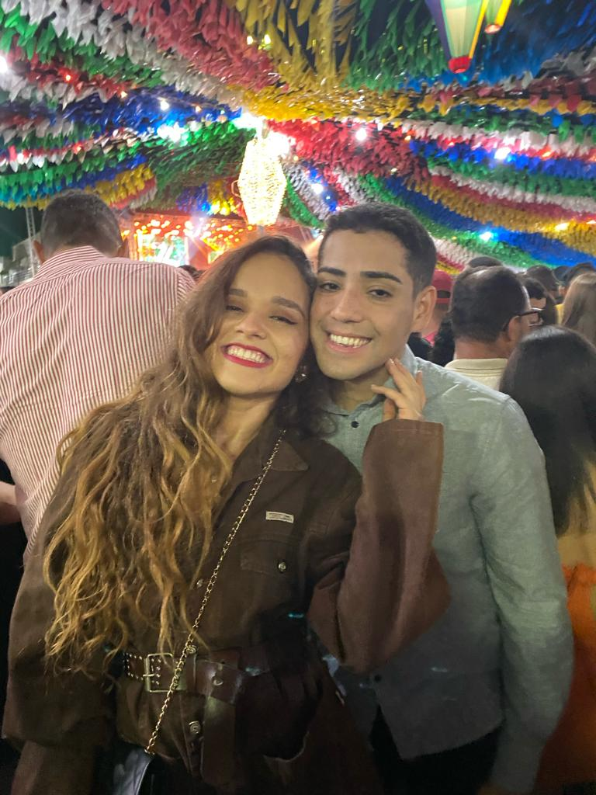

# 💊 Código Curativo

## ✍🏼 Descrição
 Este projeto é uma página web interativa que exibe mensagens motivacionais com o intuito de melhorar o dia de Lucas Moreira.

Foto com Lucas 

 ## 👩🏼‍💻 Tecnologias Utilizadas
- HTML
- CSS   
- JavaScript

## 🏗️ Estrutura do Projeto
- **index.html**: Contém a estrutura básica da página web.
- **script.js**: Inclui a lógica para exibir mensagens motivacionais aleatórias, incluindo um poema personalizado.
- **styles.css**: Define o estilo e o layout da página web. 

## 📑 Como Usar
Para visualizar e interagir com a página web do projeto:

1. Preparação do Ambiente:
- Certifique-se de ter um navegador web instalado.
- Baixe todos os arquivos do projeto para uma mesma pasta em seu computador.

2. Abrir a Página Web:
- Navegue até a pasta onde os arquivos foram salvos.
- Encontre o arquivo index.html.
- Clique duas vezes no arquivo index.html para abri-lo em seu navegador padrão.

3. Interagir com a Página:
- Uma vez que a página esteja carregada, você deverá ver a interface definida pelo HTML e CSS.
- Interaja com os elementos da página conforme projetado.

